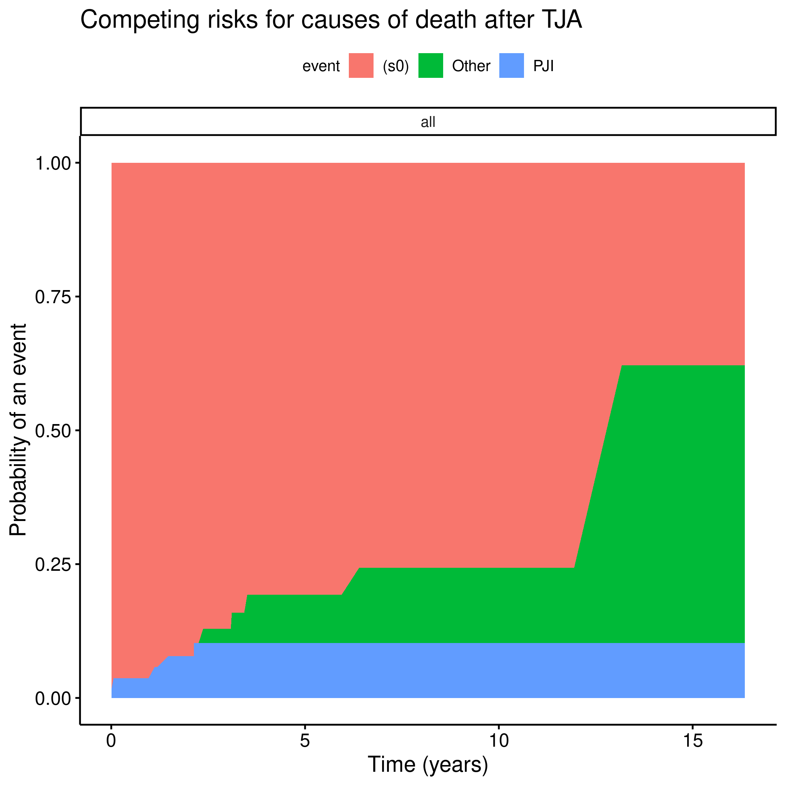
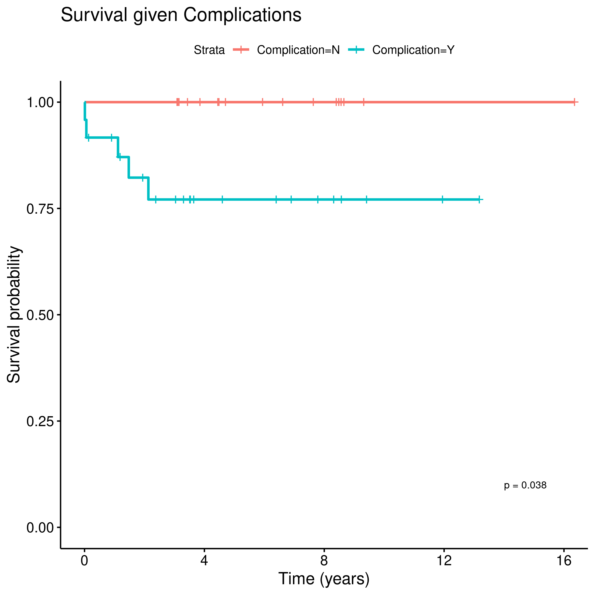
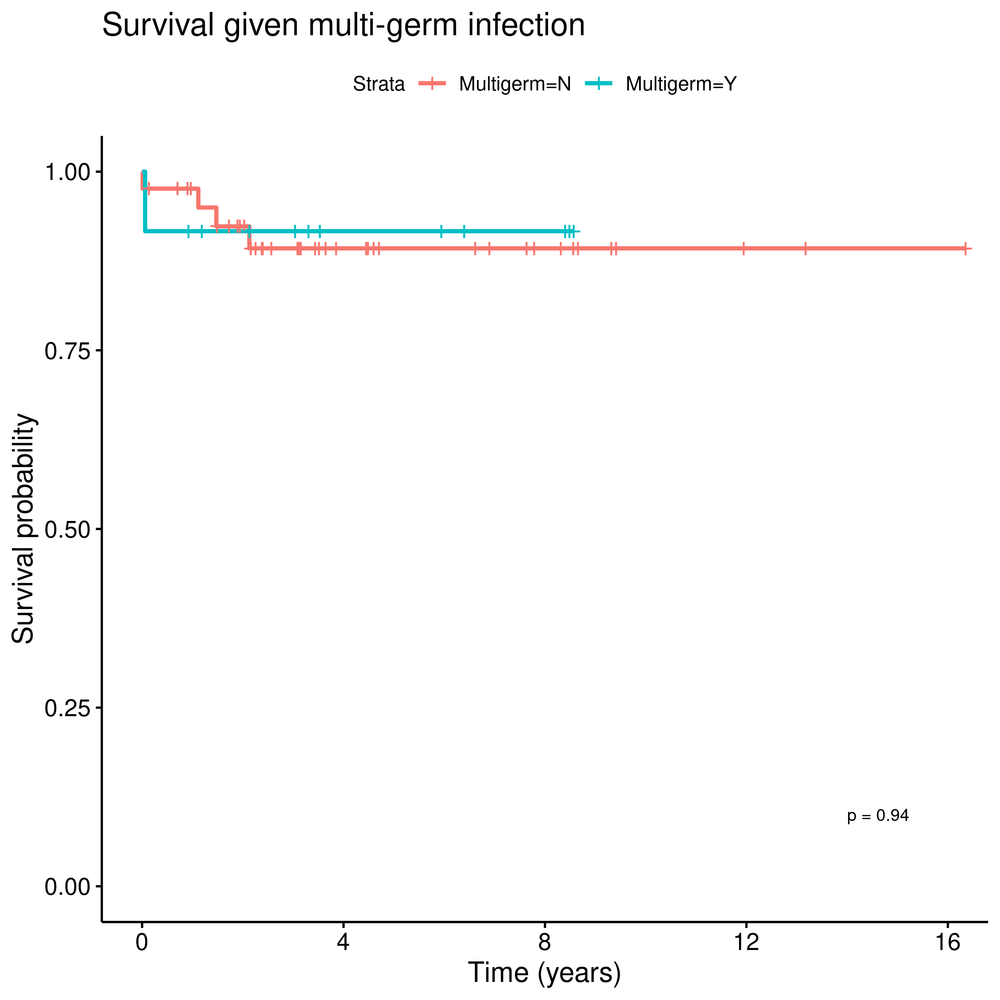
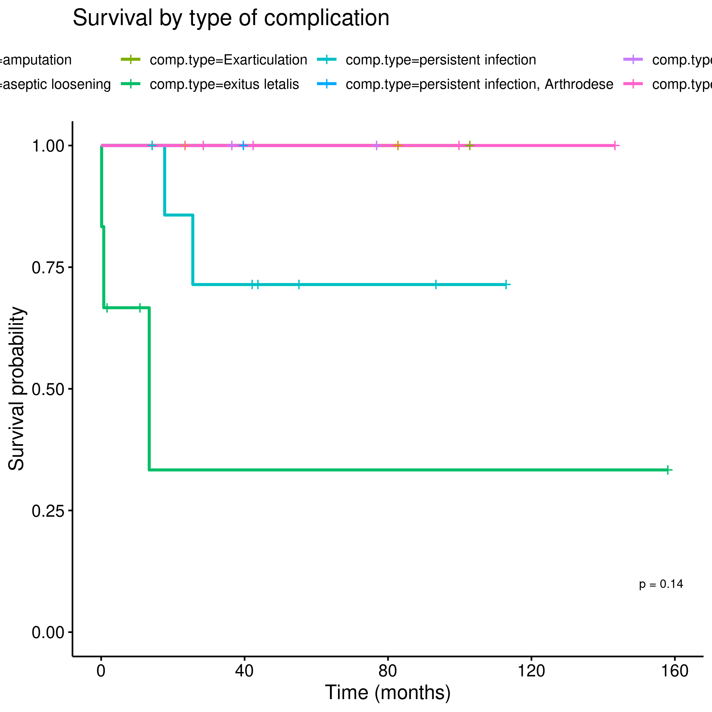

```{r setup, include=FALSE}
knitr::opts_chunk$set(echo = FALSE)
knitr::opts_knit$set(root.dir = normalizePath(".."))
options(scipen = 999)
library(pander)
library(knitr)
library(philsfmisc)
panderOptions('table.style', 'rmarkdown')
panderOptions('table.split.table', 160)
```

---

**Document version**

```{r history}
Version <- c("01")
Changes <- c("Initial version")
history <- cbind(Version, Changes)
colnames(history) <- c("Version", "Alterations")
# pander(history, split.cells = 70)
kable(history)
```

---

# Abbreviations

- PJI:
- SD: standard deviation
- SIRS: systemic inflammatory response
- TJA:

# Introduction

## Objectives

Perform a Kaplan-Meier survival analysis on the deaths caused by PJI after a TJA surgical procedure.
Additionally, explore possible risk factor for PJI mortality in bi-variate analyses.

## Data reception and cleaning

**Analytical data-set**

1. ID
1. Age; continuous
1. Sex; binary
1. time (date PJI diagnosis -- date last follow up)
1. event (death due to PJI)
1. death (all causes)
1. Joint; binary
1. SIRS; binary
1. Multi-germ infection; binary
1. Complication; binary
1. Surgery type; categorical
1. Surgery success; binary

Obs: Complication Type was considered for analysis, but could not be safely converted to a categorical variable.
It was dropped.

# Methods

```{r results, include=FALSE}
source("scripts/results.R", encoding = 'UTF-8')
```

## Variables

### Outcome and time definition

<!-- - event: death due to PJI -->
<!--   - deaths due to other causes were censored -->
<!-- - time: between PJI diagnosis and event -->

The event of interest for this analysis is death caused by the PJI.
For the main analysis patients that died from other causes were censored.
The time to event was defined as the number of years between the diagnosis of PJI and the last follow up noted.

There were multiple outcomes to consider regarding the mortality in PJI patients.
These causes were categorized as being caused by PJI (event of interest), other causes of death and survival (censored).
This multi-state outcome was used to assess the competing risks of death under the PJI risk.
The follow up time of all participants was considered in the person-year at risk.

### Covariates

- Sex; binary
- Joint; binary
- Complication; binary
- SIRS; binary
- Multi-germ infection; binary
- Surgery success; binary
- Surgery type; categorical

## Statistical analyses

<!-- - descriptive analysis of study population -->
<!-- - Kaplan-Meier estimates for 2-year survival -->
<!-- - bi-variate analyses of covariates with log-rank test -->
<!-- - significance alpha = 0.05 -->

Demographic characteristics were described with mean (SD) or proportions, where appropriate.
Kaplan-Meier curves were computed for the at-risk study population for the event of interest.
For all covariates considered the 2-year survival rates were computed for the event of interest.
The all-cause mortality was assessed using the competing risks overall figure.
Bi-variate analyses were performed using the log-rank test for all covariates considered.
All statistical analyses considered the significance level of 5%.

### Statistical packages

This analysis was performed using statistical software `R` version 4.0.5.
Packages used for survival analyses were `survival` version 3.2.10 and `survminer` version 0.4.9.

# Results

## Study population and follow up

<!-- - n = 54, 239 person-years -->
<!-- - sex: males: 21 (39%), females: 33 (61%) -->
<!-- - age: min = 32, max = 88 -->
<!--   - mean 64.3 years (SD 11.6) -->
<!-- - follow up time: min = 4 days, max = 16.35 years -->

Of the 54 participants were included, 21 (39%) were male and 33 (61%) were female.
Average (SD) age was 64.3 (11.6) years, ranging from 32 to 88 years.
Time under observation ranged from 4 days to 16.35 years, where all 54 participants contributed with a total of 239 person-years of follow up.

## Mortality

<!-- - mortality: 5 PJI + 5 Other -->
<!-- - no median time for deaths -->
<!--   - deaths times: PJI 4 days -- 2.13 years -->
<!--   - Other 2.37 years -- 13.17 years -->

44 of the 54 patients survived until the last follow up observation.
Of the deaths recorded, 5 from other causes and 5 could be attributed to PJI (Fig 1).
All deaths attributed to PJI occurred before the deaths unrelated.
Figure 2 shows the Kaplan-Meier estimate of the mortality rate attributed to PJI.
Times of death ranged from 4 days to 2.13 years.
The survival rate at the end of study follow up was 89.7% so the median time of survival could not be estimated.
The 1-year survival rate was estimated as 96% (91% -- 100%) and the 2-year survival rate was estimated as 92% (85% -- 100%).

Times of deaths unrelated to PJI ranged from 2.37 years to 13.17 years (Fig 1).
It is noticeable that, while this analysis does not give proof that there is a significant difference between times of death between all causes, this sample seem to indicate that most patients die from PJI within 2 years of the diagnosis (Fig 2).


**Figure 1** Mortality due to all causes.


**Figure 2** Mortality confirmed to be caused by PJI.

## 2-year survival rates

Table 1 shows the 2-year survival rates across all covariates considered.
In this sample surgical complications decreased the survival (log-rank p=0.038), and most events were related to the procedure of Spacer, where the median time of survival was 3.14 weeks (log-rank p=0.002).

```{r tab1, message=FALSE, warning=FALSE}
tbl_km %>% kable(align = "ccc", caption = "**Table 1** Survival rates for 2-year.")
```

Although a significant difference in the status of surgery success was not detected it could be possible that there is a true association between these predictos.
This variable had 18 missing values in the sample that were dropped from the analysis.
Oh the other hand the effect of a surgical complication is strong enough to be detected even in the presence of 13 missing values in the sample.

# Exceptions and Observations

# Conclusions

# References

# Appendix

## Exploratory data analysis

<!-- ```{r fig3, fig.height=12, fig.width=8} -->
<!-- ggarrange(gg.sex$plot, gg.sirs$plot, gg.joint$plot, gg.stat.tja$plot, gg.outcome$plot, gg.comp$plot, labels = "AUTO", ncol = 2, nrow = 3) -->
<!-- ``` -->

```{r A1, fig.cap="**Figure A1** Mortality by Sex."}
# 
knitr::include_graphics("../figures/Sex.png", error = FALSE)
```

```{r A2, fig.cap="**Figure A2** Mortality by joint."}
# 
knitr::include_graphics("../figures/Joint.png", error = FALSE)
```

```{r A3, fig.cap="**Figure A3** Mortality under presence of surgical complication."}
# 
knitr::include_graphics("../figures/Complication.png", error = FALSE)
```

```{r A4, fig.cap="**Figure A4** Mortality by Multi-germ."}
# 
knitr::include_graphics("../figures/Multigerm.png", error = FALSE)
```

```{r A5, fig.cap="**Figure A5** Mortality by SIRS."}
# 
knitr::include_graphics("../figures/SIRS.png", error = FALSE)
```

```{r A6, fig.cap="**Figure A6** mortality by status of the TJA."}
# 
knitr::include_graphics("../figures/surg_success.png", error = FALSE)
```

```{r A7, fig.cap="**Figure A7** Mortality by surgery outcome."}
# 
knitr::include_graphics("../figures/surg_type.png", error = FALSE)
```

<!--  -->
<!-- Fig 9: Mortality by complication type. -->

## Alternative results table

```{r tab2, message=FALSE, warning=FALSE}
tbl_km2 %>%
  kable(align = "cccc",
    caption = "**Table 2** Optional version of Table 1, adding 1-year survival rates."
  )
```


## Availability

<!-- Both this document and the corresponding analytical plan (**SAP-2021-001-LT-v01**) can be downloaded in the following address: -->

This document can be downloaded in the following address:

https://github.com/philsf-biostat/SAR-2021-001-LT/

## Analytical dataset

Due to confidentiality the data-set used in this analysis cannot be shared online in the public version of this report.

```{r data}
# print analytical of analytical_mockup whether it is the private or public version of the SAR

# analytical %>%
#   pander(caption = "**Table A1** Analytical dataset")
analytical_mockup %>%
  pander(caption = "**Table A1** Analytical dataset structure")
```
