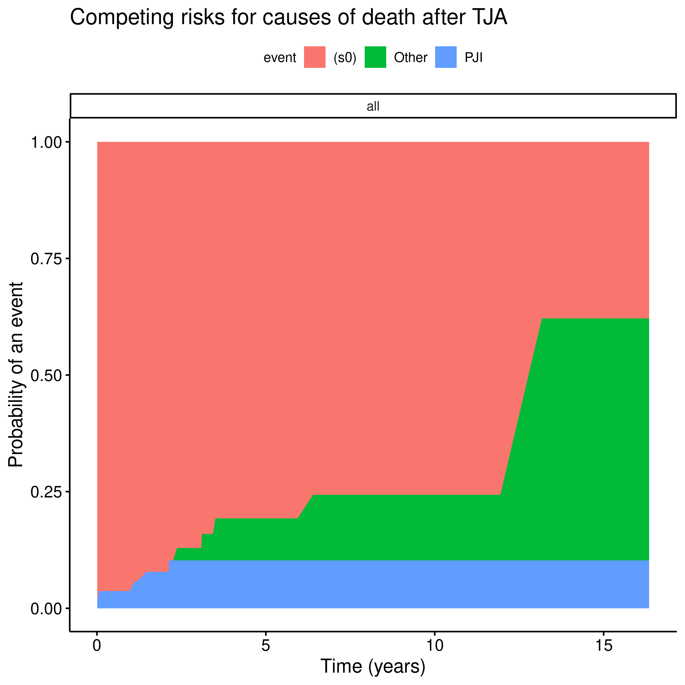
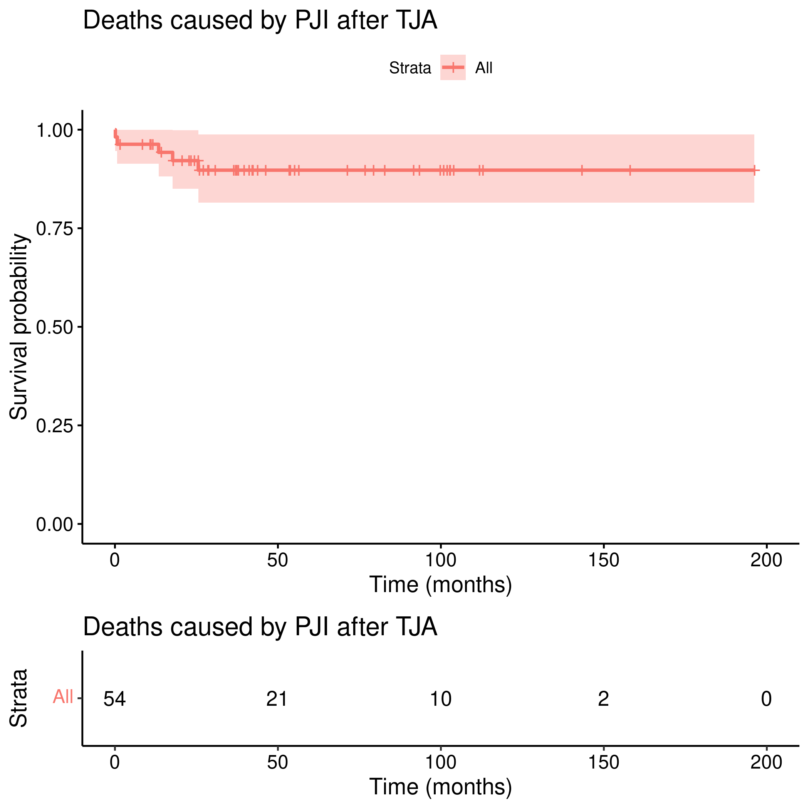
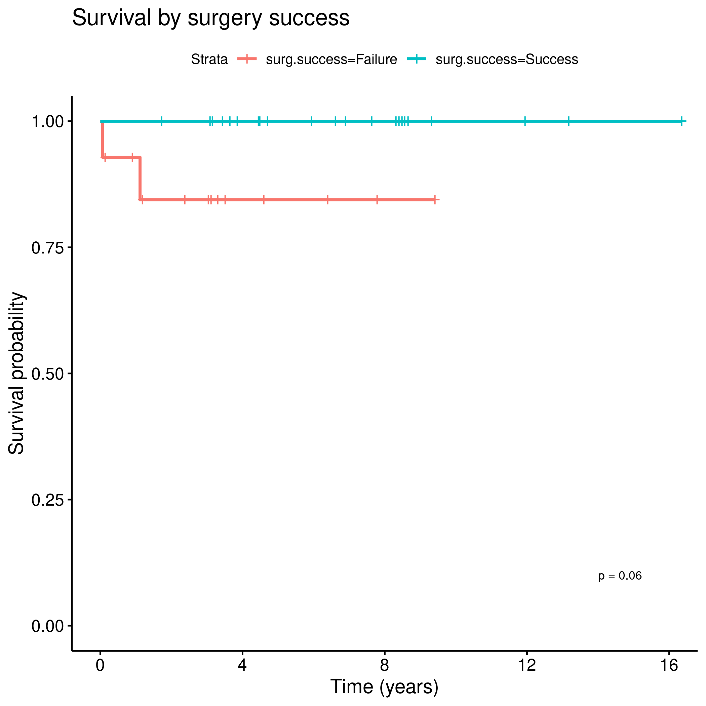
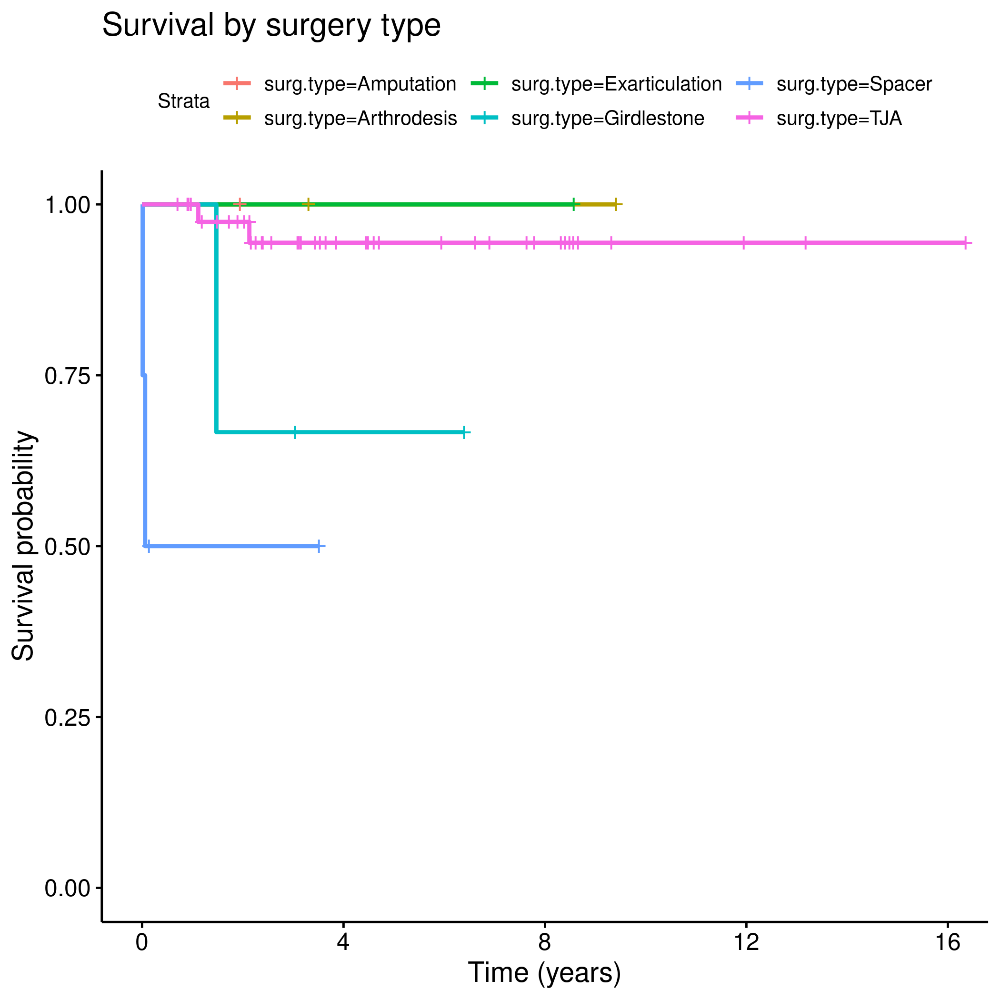
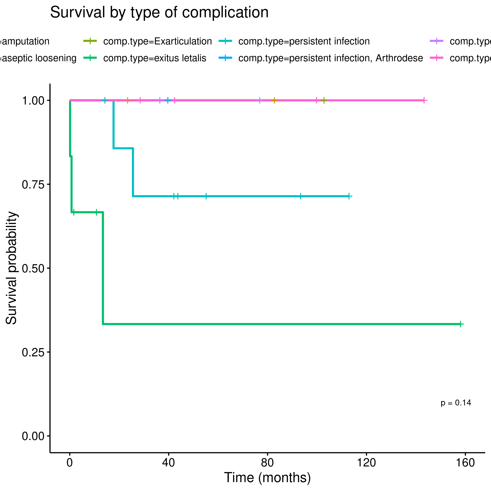

```{r setup, include=FALSE}
knitr::opts_chunk$set(echo = FALSE)
knitr::opts_knit$set(root.dir = normalizePath(".."))
options(scipen = 999)
library(pander)
library(knitr)
library(philsfmisc)
```

---

**Document version**

```{r, echo = FALSE}
Version <- c("01")
Changes <- c("Initial version")
history <- cbind(Version, Changes)
colnames(history) <- c("Version", "Alterations")
# pander(history, split.cells = 70)
kable(history)
```

---

<!-- # Signatures -->

<!-- ```{r, echo=FALSE} -->
<!-- sig.field <- "__________________________" -->
<!-- date.field <- "_____________" -->
<!-- Stat <- c("Elaborador", "Nome", "Função", sig.field, date.field) -->
<!-- Reviewer <- c("Revisado por", "", "", sig.field, date.field) -->
<!-- Approver <- c("Verificado por", "", "", sig.field, date.field) -->
<!-- Final.Approver <- c("Aprovação final", "", "", sig.field, date.field) -->

<!-- sigs <- rbind( -->
<!--   Stat -->
<!--   , Reviewer -->
<!--   , Approver -->
<!--   , Final.Approver -->
<!--   ) -->
<!-- rownames(sigs) <- NULL -->
<!-- colnames(sigs) <- c("Papel", "Nome", "Função", "Assinatura", "Data") -->

<!-- # pander(sigs, split.cells = c(9, 14, 14, 16, 8), split.table = Inf) -->
<!-- kable(sigs) -->
<!-- ``` -->

# Abbreviations

- PJI:
- SIRS: systemic inflamtory response
- TJA:

# Introduction

## Objectives

## Data reception and cleaning

**Analytical dataset**

1. id
1. age; continuous
1. sex; binary
1. sirs; binary
1. joint; binary
1. surgery success; binary
1. surgery type; categorical
1. multigerm infection; binary
1. complication; binary
1. time (date PJI diagnosis -- date last followup)
1. event (death due to PJI)
1. death (all causes)

Obs: Complication Type was considered for analysis, but could not be safely converted to a categorical variable.
It was dropped.

# Methods

```{r analysis, include=FALSE}
source("scripts/results.R", encoding = 'UTF-8')
```

## Outcome and covariates

### Event and time definition

- event: death due to PJI
  - deaths due to other causes were censored
- time: between PJI diagnosis and event

### Covariates

- sex; binary
- sirs; binary
- joint; binary
- surgery success; binary
- surgery type; categorical
- multigerm infection; binary
- complication; binary

## Statistical analyses

- descriptive analysis of study population
- kaplan-meier estimates for 2-year survival
- bivariate analyses of covariates with log-rank test
- significance alpha = 0.05

### Statistical packages

This analysis was performed using statistical software `R` version `r getRversion()`.
Packages used for survival analyses were `survival` version `r packageVersion("survival")` and `survminer` version `r packageVersion("survminer")`.

# Results

## Study population and follow up

- n = 54, 239 person-years
- sex: males: 21 (39%), females: 33 (61%)
- age: min = 32, max = 88
- median age: 67 years (IQR: 60 -- 70)
- followup time: min = 4 days, max = 16.35 years

## Mortality

- mortality: 5 PJI + 5 Other
- no median time for deaths
  - deaths times: PJI 4 days -- 2.13 years
  - Other 2.37 years -- 13.17 years


Fig 1: Mortality due to all causes.


Fig 2: Mortality confirmed to be caused by PJI.

## 2-year survival rates

```{r tab1, message=FALSE, warning=FALSE}
kable(tbl_km)
```

Table: **Table 1** Survival rates for 2-year.

# Exceptions and Observations

# Conclusions


# References

# Appendix

## Exploratory data analysis

<!-- ```{r fig3, fig.height=12, fig.width=8} -->
<!-- ggarrange(gg.sex$plot, gg.sirs$plot, gg.joint$plot, gg.stat.tja$plot, gg.outcome$plot, gg.comp$plot, labels = "AUTO", ncol = 2, nrow = 3) -->
<!-- ``` -->


Fig 3: Mortality by sex.


Fig 4: Mortality by SIRS.


Fig 5: Mortality by joint.


Fig 6: mortality by status of the TJA.


Fig 7: Mortality by surgery outcome.


Fig 8: Mortality under presence of surgical complication.

<!--  -->
<!-- Fig 9: Mortality by complication type. -->

## Alternative results table

```{r tab2, message=FALSE, warning=FALSE}
kable(tbl_km2)
```

Table: **Table 2** Optional version of Table 1, adding 1-year survival rates.

## Analytical dataset

```{r data}
kable(dtmin)
```
