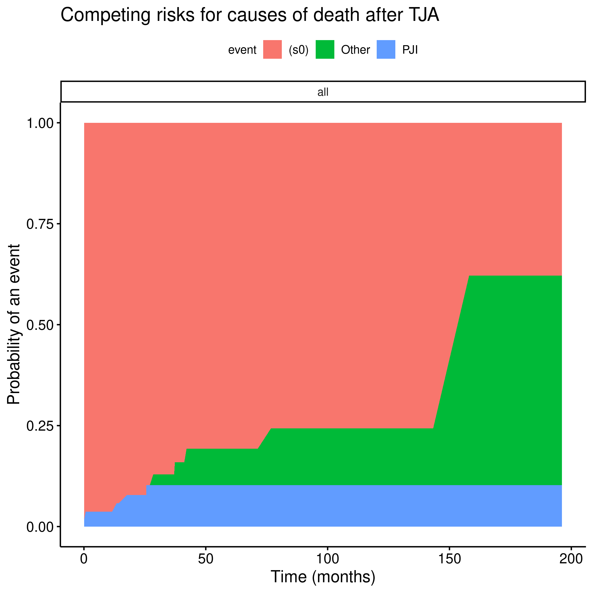
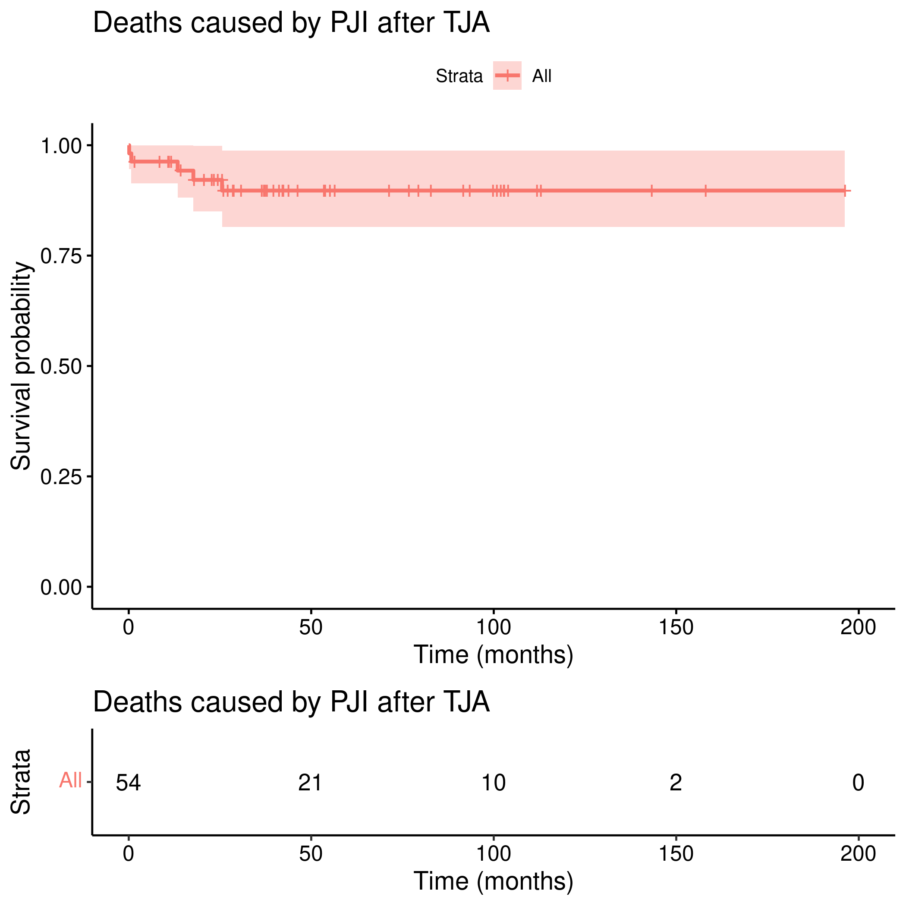
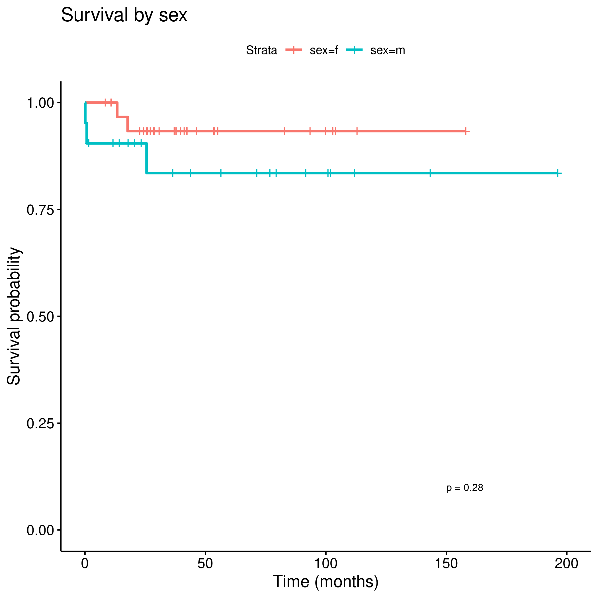
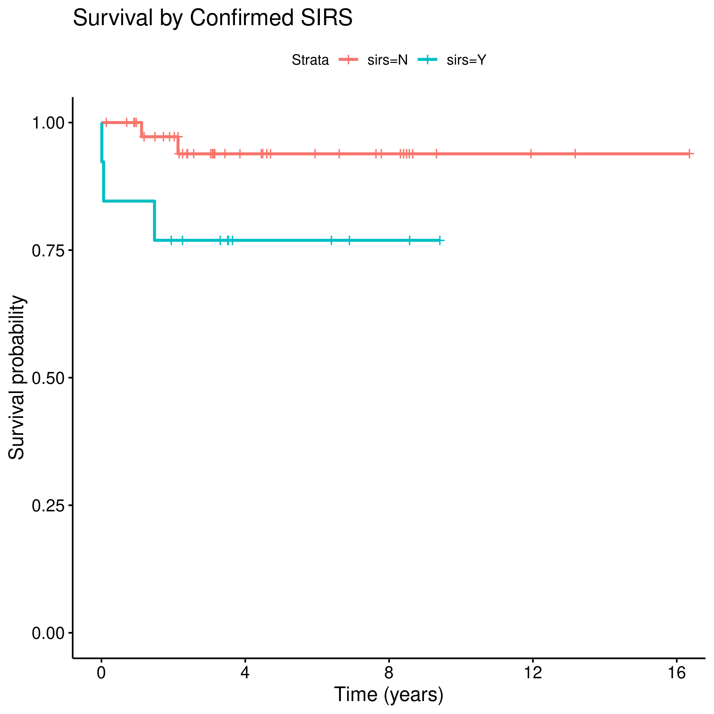
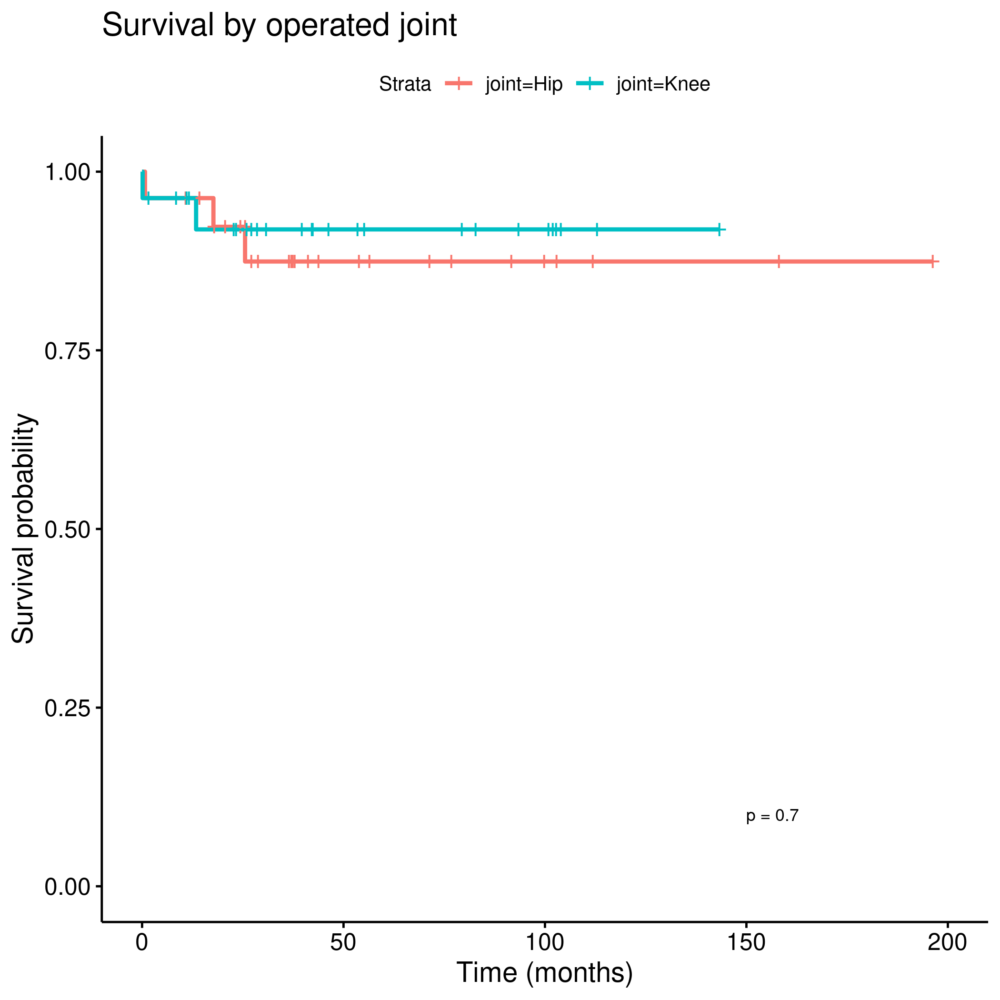
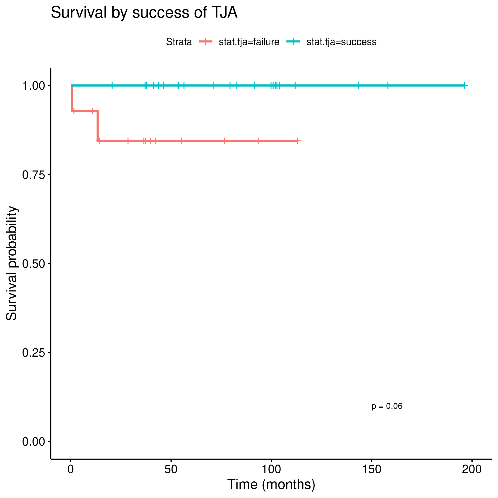
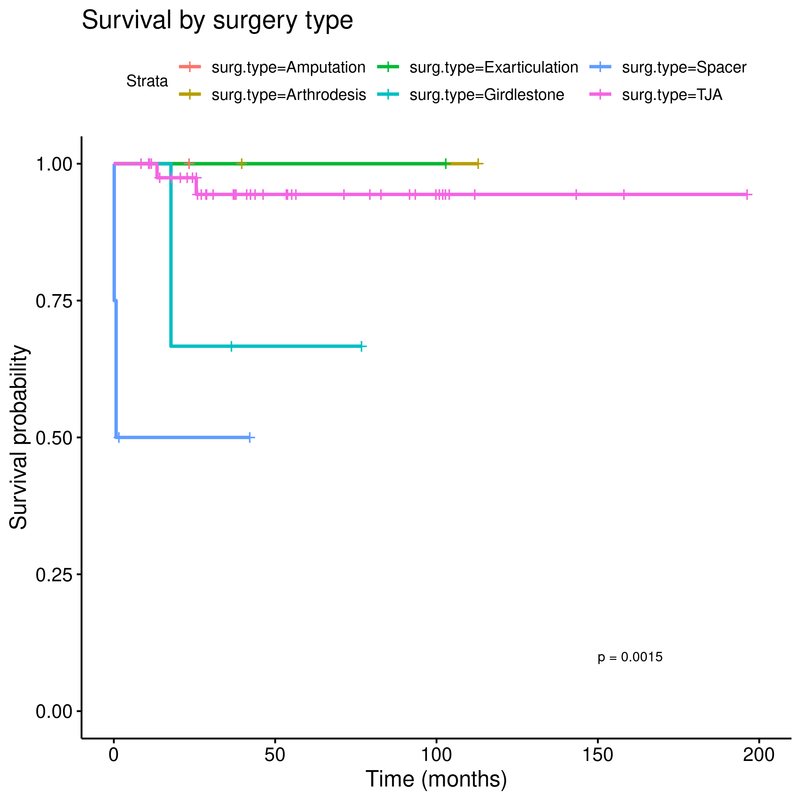
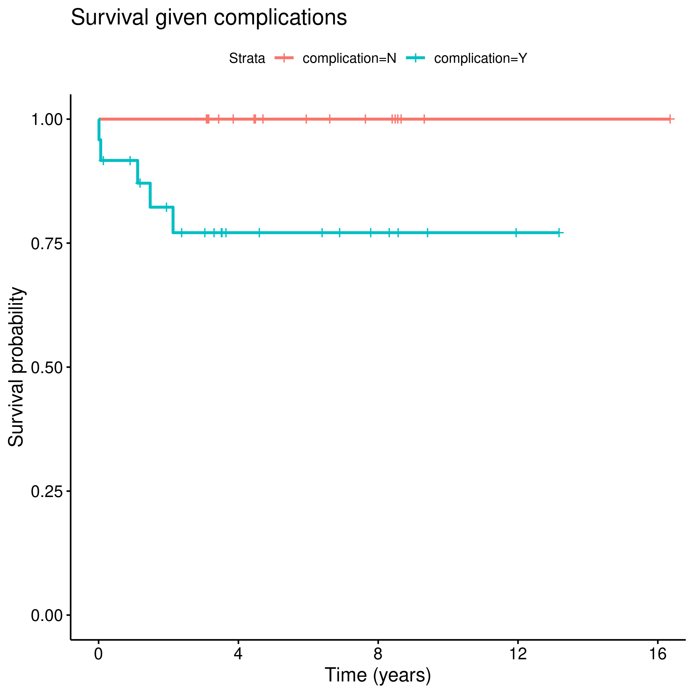
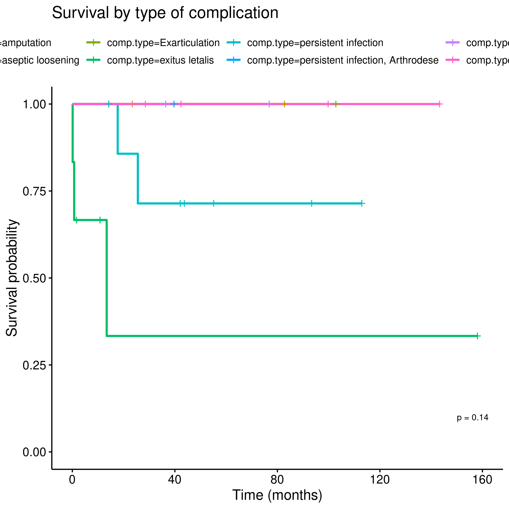

---

**Document version**


|Version |Alterations     |
|:-------|:---------------|
|01      |Initial version |

---

<!-- # Signatures -->

<!-- ```{r, echo=FALSE} -->
<!-- sig.field <- "__________________________" -->
<!-- date.field <- "_____________" -->
<!-- Stat <- c("Elaborador", "Nome", "Função", sig.field, date.field) -->
<!-- Reviewer <- c("Revisado por", "", "", sig.field, date.field) -->
<!-- Approver <- c("Verificado por", "", "", sig.field, date.field) -->
<!-- Final.Approver <- c("Aprovação final", "", "", sig.field, date.field) -->

<!-- sigs <- rbind( -->
<!--   Stat -->
<!--   , Reviewer -->
<!--   , Approver -->
<!--   , Final.Approver -->
<!--   ) -->
<!-- rownames(sigs) <- NULL -->
<!-- colnames(sigs) <- c("Papel", "Nome", "Função", "Assinatura", "Data") -->

<!-- # pander(sigs, split.cells = c(9, 14, 14, 16, 8), split.table = Inf) -->
<!-- kable(sigs) -->
<!-- ``` -->

# Abbreviations

# Introduction

## Objectives

## Data reception and cleaning

# Methods


This analysis was performed using statistical software `R` version 4.0.5.
Packages used for survival analyses were `survival` version 3.2.10 and `survminer` version 0.4.9.

# Results



Fig 1: Mortality due to all causes.


Fig 2: Mortality confirmed to be caused by PJI.


|Characteristic                    |2-year survival   |p     |
|:---------------------------------|:-----------------|:-----|
|Overall                           |92% (85%, 100%)   |      |
|sex                               |                  |0.275 |
|f                                 |93% (85%, 100%)   |      |
|m                                 |90% (79%, 100%)   |      |
|sirs                              |                  |0.056 |
|N                                 |97% (92%, 100%)   |      |
|Y                                 |77% (57%, 100%)   |      |
|joint                             |                  |0.703 |
|Hip                               |92% (83%, 100%)   |      |
|Knee                              |92% (82%, 100%)   |      |
|surg.success                      |                  |0.060 |
|failure                           |84% (67%, 100%)   |      |
|success                           |100% (100%, 100%) |      |
|outcome                           |                  |0.002 |
|Amputation                        |— (—, —)          |      |
|Arthrodesis                       |100% (100%, 100%) |      |
|Exarticulation                    |100% (100%, 100%) |      |
|Girdlestone                       |67% (30%, 100%)   |      |
|Spacer                            |50% (19%, 100%)   |      |
|TJA                               |97% (93%, 100%)   |      |
|multigerm                         |                  |0.938 |
|N                                 |92% (84%, 100%)   |      |
|Y                                 |92% (77%, 100%)   |      |
|comp                              |                  |0.038 |
|N                                 |100% (100%, 100%) |      |
|Y                                 |82% (68%, 100%)   |      |
|comp.type                         |                  |0.144 |
|amputation                        |— (—, —)          |      |
|aseptic loosening                 |100% (100%, 100%) |      |
|Exarticulation                    |100% (100%, 100%) |      |
|exitus letalis                    |33% (7.5%, 100%)  |      |
|persistent infection              |86% (63%, 100%)   |      |
|persistent infection, Arthrodese  |100% (100%, 100%) |      |
|persistent infection, Girdlestone |100% (100%, 100%) |      |
|Re-Infection                      |100% (100%, 100%) |      |

Table: **Table 1** Survival rates for 2-year.

# Exceptions and Observations

# Conclusions


# Referecens

# Appendix

<!-- ```{r fig3, fig.height=12, fig.width=8} -->
<!-- ggarrange(gg.sex$plot, gg.sirs$plot, gg.joint$plot, gg.stat.tja$plot, gg.outcome$plot, gg.comp$plot, labels = "AUTO", ncol = 2, nrow = 3) -->
<!-- ``` -->


Fig 3: Mortality by sex.


Fig 4: Mortality by SIRS.


Fig 5: Mortality by joint.


Fig 6: mortality by status of the TJA.


Fig 7: Mortality by surgery outcome.


Fig 8: Mortality under presence of surgical complication.


Fig 9: Mortality by complication type.


<!-- Table: **Table 2** Optional version of Table 1, adding 1-year survival rates. -->
